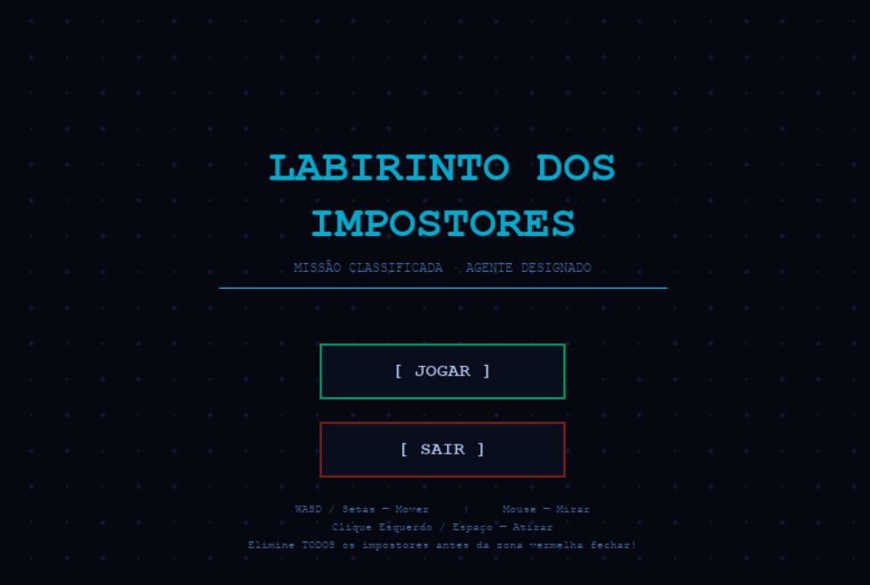
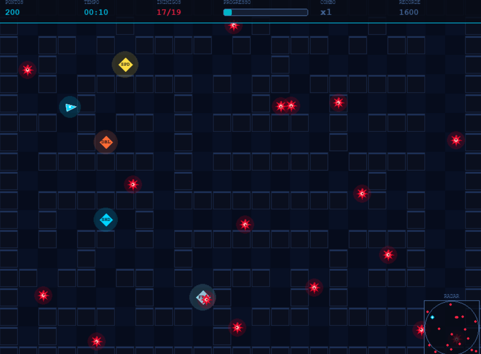
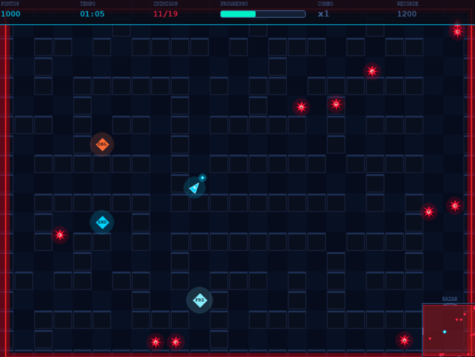

<div align="center">

# 🎮 ZERK

### Jogo 2D de ação e sobrevivência desenvolvido com Python e Pygame-ce

<p align="center">
  
</p>

Sobreviva em um labirinto hostil enquanto enfrenta inimigos cada vez mais agressivos, coleta power-ups estratégicos enquanto escapa da Zona Vermelha.

Desenvolvido com foco em arquitetura modular, programação orientada a objetos, gerenciamento de estados, lógica de comportamento dos NPCs e sistemas de gameplay escaláveis.

<br>


</div>

---

> **Conceitos aplicados**
>
> - Programação Orientada a Objetos (POO)
> - Arquitetura Modular
> - Gerenciamento de Estados
> - Lógica de comportamento dos NPCs
> - Sistema de Colisão
> - Persistência de Dados com JSON

---

# 🚀 Principais Funcionalidades

| Recurso | Descrição |
|----------|----------|
| 🎯 **Combate Dinâmico** | Sistema de disparos com mira baseada no mouse |
| 🤖 **Movimentação Procedural** | Comportamento autônomo que aumenta a tensão do jogo. |
| 🔥 **Zona Vermelha** | Área letal que reduz gradualmente o espaço seguro |
| 💎 **Power-ups Estratégicos** | Habilidades temporárias que alteram a dinâmica do jogo |
| 🏆 **Sistema de Combo** | Multiplicadores de pontuação por eliminações consecutivas |
| 📈 **Dificuldade Progressiva** | Desafio crescente a cada nova partida |

---

# 📸 Galeria
### Tela Inicial

<p align="center">
  
</p>

### Gameplay
<p align="center">
  
</p>

### Zona Vermelha
<p align="center">
  
</p>

---

# 🏗️ Arquitetura

O projeto foi estruturado seguindo princípios de modularização, separação de responsabilidades e reutilização de código, facilitando manutenção, escalabilidade e evolução de novas mecânicas.

### Princípios adotados

- Separação de responsabilidades
- Modularização
- Reutilização de código
- Escalabilidade para novas funcionalidades

### Estrutura dos módulos

| Módulo | Responsabilidade |
|---------|---------|
| `main.py` | Inicialização e loop principal |
| `game_state.py` | Coordenação dos sistemas do jogo |
| `player.py` | Movimentação, disparos e projéteis |
| `enemy.py` | Comportamento dos inimigos |
| `tilemap.py` | Labirinto e sistema de colisões |
| `zone.py` | Zona Vermelha e power-ups |
| `hud.py` | Interface do usuário |
| `menu.py` | Navegação e menu inicial |

---

# 🎮 Sobre o Jogo

O objetivo é eliminar todos os impostores antes que eles ou a Zona Vermelha eliminem você.

Durante a partida:

- Encostar em um impostor resulta em derrota.
- A Zona Vermelha é letal.
- As paredes bloqueiam o movimento.
- O nível de dificuldade aumenta continuamente.

---

# 🎯 Mecânicas de Jogo

## Zona Vermelha

A Zona Vermelha é ativada quando:

- 30 segundos de partida se passam;

**ou**

- Restam apenas 6 impostores.

Após sua ativação, a área segura diminui progressivamente, aumentando a pressão sobre o jogador.

---

## Sistema de Power-ups

| Power-up | Efeito |
|-----------|-----------|
| `SPD` | Aumenta a velocidade do jogador |
| `DBL` | Disparo duplo |
| `SHD` | Invulnerabilidade temporária |
| `FRZ` | Congela a expansão da Zona Vermelha |

---

## Sistema de Combo

Eliminar inimigos em sequência aumenta o multiplicador de pontuação.

```text
x1 → x2 → x3 → ... → x10
```

Quanto maior a sequência, maior a pontuação obtida.

---

## Dificuldade Progressiva

A cada nova partida:

- Os impostores ficam mais rápidos.
- A pressão aumenta constantemente.
- A velocidade máxima dos inimigos pode atingir:

```text
5.0
```

---

# 🕹️ Controles

| Tecla | Ação |
|--------|--------|
| W A S D | Movimentação |
| ↑ ↓ ← → | Movimentação |
| Mouse | Mira |
| Clique Esquerdo | Atirar |
| Espaço | Atirar |
| Enter | Iniciar / Reiniciar |
| ESC | Retornar ao Menu |

---

# ⚙️ Instalação

### Requisitos

- Python 3.10 até 3.12
- pip

### Clonar o projeto

```bash
git clone https://github.com/JulianaCosta01/game-labirinto-impostores.git
cd game-impostores-ofc
```

### Instalar dependências

```bash
pip install pygame-ce
```

### Executar

```bash
python main.py
```

---

# 🛠️ Tecnologias Utilizadas

| Tecnologia | Utilização |
|------------|------------|
| Python | Linguagem principal |
| Pygame-ce | Framework para desenvolvimento do jogo |
| JSON | Persistência local de recordes |
| Git | Controle de versão |
| GitHub | Hospedagem e versionamento do projeto |

---

# 📂 Estrutura do Projeto

```text
game-impostores-ofc/
│
├── main.py
├── menu.py
├── game_state.py
├── config.py
├── tilemap.py
├── player.py
├── enemy.py
├── zone.py
├── hud.py
├── save.json
│
└── assets/
    ├── images/
    ├── sounds/
    |
```

---

# 👥 Autores

| Desenvolvedor | Responsabilidades |
|---------------|------------------|
| Juliana Ferreira Costa | Desenvolvimento, arquitetura, gameplay e documentação |
| João Amândio Avelar do Amaral | Desenvolvimento, arquitetura e gameplay |

---

# 🎵 Créditos

Músicas, efeitos sonoros e demais recursos de terceiros permanecem sob os direitos de seus respectivos autores e licenciadores.

Todos os recursos foram utilizados de acordo com suas respectivas licenças de uso.

Caso aplicável, os créditos específicos encontram-se junto às respectivas fontes ou arquivos utilizados no projeto.

---

# 📜 Licença

Este projeto é distribuído sob a licença **MIT**.

O código-fonte pode ser utilizado, modificado e distribuído conforme os termos descritos no arquivo `LICENSE`.

---

<div align="center">

### Desenvolvido por Juliana Costa e João Amândio Avelar

⭐ Se este trabalho foi interessante para você, considere deixar uma estrela no repositório.

</div>
